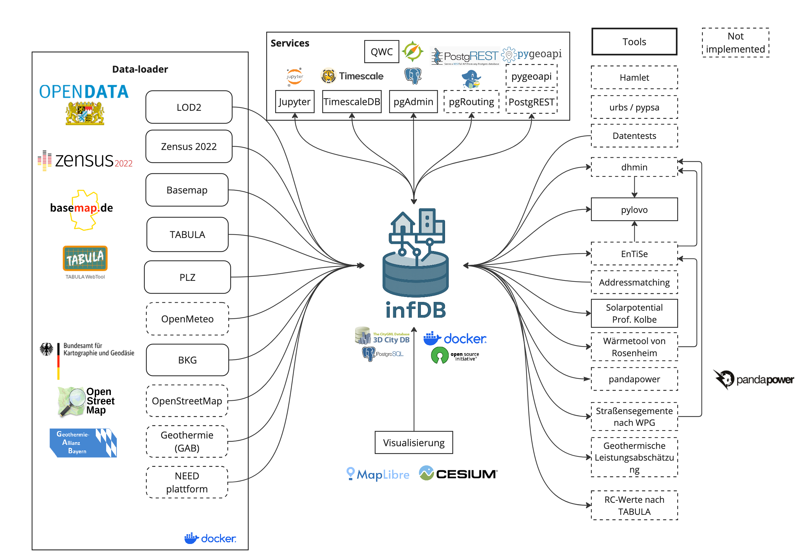

# Welcome to infDB :simple-rocket:

<!-- **The infDB (Infrastructure and Energy Database) is a user-friendly, platform-independent, and open-source data infrastructure as a foundation for energy system analyses. It enables complex evaluations by combining various tools through standardized interfaces, fostering an open and interoperable ecosystem.** -->

<!-- ## Table of Contents

- [Purpose](#purpose)
- [How it works?](#how-it-works)
- [Getting Started](#getting-started)
  - [Installation for local development](#installation-for-local-development)
- [For Developers](#for-developers)
   - [Repository Structure](#repository-structure)
   - [Usage Guidelines](#usage-guidelines)
   - [Basic API Usage](#basic-api-usage)
   - [Development Workflow](#development-workflow)
   - [API Documentation](#api-documentation)
   - [CI/CD Workflow](#cicd-workflow)
   - [Development Resources](#development-resources)
   - [Contribution and Code Quality](#contribution-and-code-quality)
- [License and Citation](#license-and-citation) -->

<!-- ## Purpose -->

  

The **infDB - Infrastructure and Energy Database** provides a modular and easy-to-configure open-source data and tool infrastructure equipped with essential services, designed to minimize the effort required for data management. Its primary mission is to empower the growth of an ecosystem by offering standardized interfaces and APIs. This platform-independent approach streamlines collaboration in energy modeling and analysis, allowing users to dedicate their focus to generating insights rather than handling data logistics.

The key features of the infDB:

:material-plus-circle: Supports geospatial, time series, and CityGML data

:material-plus-circle: Platform independent

:material-plus-circle: Modular and flexible

:material-plus-circle: Open and standardized interfaces and APIs

:material-plus-circle: Open Source - no limiting or restricting licenses

## Why use it?
The infDB can be used effectively wherever geospatial and time series information is required. Possible applications include:

- Energy System Modeling
- Municipal Heat Planning and Infrastructure Planning in general
- Scenario and Geospatial Analysis

One of the major advantages is being able to draw on existing work and build on it.

## How it works
The core of the infDB is the relational database system PostgreSQL, extended by PostGIS, TimescaleDB, pgRouting, and 3D City DB to deal with geospatical, time series, and CityGML data efficiently. Preconfigured services provide base functionality and assist the user, for example, with visualization via QGIS Web Client or Jupyter Notebook. External tools can be connected through standardized interfaces and APIs. This architecture is shown in the figure below:

In summary, the infDB architecture is composed of three modules:

:material-database: **Core** – PostgreSQL database for geospatial and time series data (center)

:fontawesome-solid-gears: **Services** – Preconfigured open-source tools providing base functionality (top)

:material-tools: **Tools** – External tools and software interacting with the infDB (right)

More detailed information can be found in the [infDB section](infdb/index.md).

## Feedback and contributions
The content of this documentation is brand new! If you encounter a mistake, notice missing content, or have any other input, please get in touch on GitHub discussions, or submit an issue/pull request. For matters that should not be visible on GitHub, you can reach us at patrick.buchenberg@tum.de. We welcome any feedback or contribution to improve infDB, its components, and this documentation.