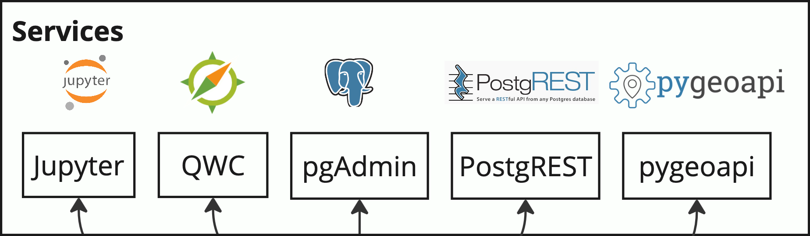

The infDB provides you can preconfigured services:



## pgAdmin


## Visualize infDB data in QWC Web Client
1. In [.env](.env) make sure profiles `core` and `qwc`to `COMPOSE_PROFILES`
2. Restart infDB with new profile to start services including QWC Web Client:
```bash
bash infdb-startup.sh
```
3. Open http://localhost:80/ in your web browser.

## Inspect infDB Data in Database with Postgres Admin UI
1. In [.env](.env) make sure profiles `core` and `admin`to `COMPOSE_PROFILES`
2. Restart infDB with new profile to start services including QWC Web Client:
```bash
bash infdb-startup.sh
```
3. Open http://localhost:82/ in your web browser.