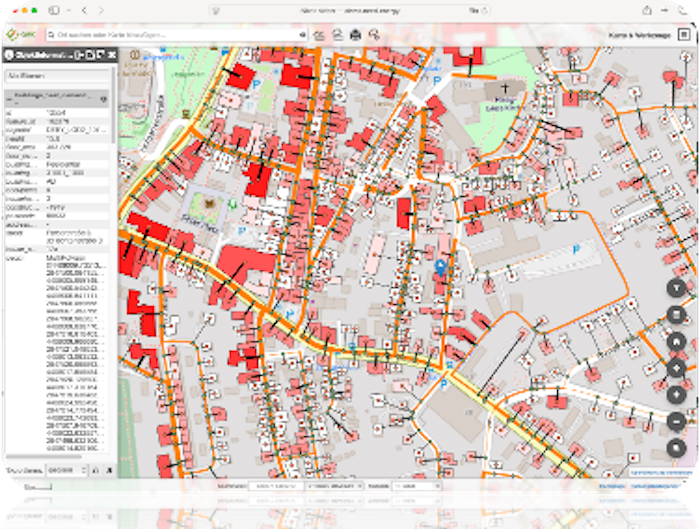

# Welcome to infDB :simple-rocket:

  

**infDB - Infrastructure and Energy Database** provides a modular and easy-to-configure open-source data and tool infrastructure. It is equipped with essential services, designed to minimize the effort required for data management. We follow a platform-independent containerized approach that streamlines collaboration in energy modeling and analysis, empowering the growth of an ecosystem by offering standardized interfaces and APIs, and by allowing users to dedicate their focus to generating insights rather than handling data logistics.
~~A ensuring data is FAIR (Findable, Accessible, Interoperable, and Reusable).~~ ###REVIEW: Ich finde das passt hier nicht###

## Key Features

: :material-plus-circle: **Geospatial, Time Series & Graph Data Support**: PostGIS, TimescaleDB and pgRouting.
: :material-plus-circle: **Platform Independent**: Containerized with Docker.
: :material-plus-circle: **Modular**: extensible via standardized APIs.
: :material-plus-circle: **Open Data**: Automatized import of common opendata sources.
: :material-plus-circle: **FAIR Data**: Focus on providing Findable, Accessible, Interoperable, and Reusable Data.
: :material-plus-circle: **Open Source**: Apache License Version 2.0.

## Why use it?

The infDB platform addresses common challenges in energy system planning and research, particularly those related to data management. By providing a standardized and modular infrastructure, infDB reduces the time and effort required to set up and maintain data systems. This allows researchers and planners to focus on their core tasks of modeling and analysis, rather than being bogged down by data logistics.

The infDB can be used effectively wherever geospatial and time series information is required. Possible applications include:

-   Infrastructure planning such as municipal heat or grid planning activities
-   Research on energy system optimization on energy transition scenarios
-   Geospatial analysis of supply and demand potentials

## Architecture

The infDB architecture is composed of two main components:

: :fontawesome-solid-gears: **[Services](usage/services.md)** – Dockerized base functionalities.
: :material-tools: **[Tools](tools/index.md)** – Use-case specific functionalities ###REVIEW: Willst du hier klarstellen, dass die tools nicht open source sind? Auch wenn closed Werkzeuge die infdb nutzen können, würde ich davon ausgehen, dass du dich hier nur auf die bestehenden offenen tools beziehst, die auch ins repo gepushed werden###

###REVIEW: Ich finde hier sollte man auch auf die Graphik eingehen###

## Getting Started

Check out the **[Usage Guide](usage/index.md)** to install, configure and run your instance.

## Demo
The **[Linear Heat Density](linear-heat-density/index.md)** use case demonstrates the capabilities of infDB in the context of municipal heat planning (KWP). 

###REVIEW: Die Graphik ist sehr unscharf###

## Contribution

Check out the **[Developer Guide](development/index.md)** to learn how to contribute.

## Feedback and contributions

The content of this documentation is brand new! If you encounter a mistake, notice missing content, or have any other input, please get in touch on [GitHub discussions](https://github.com/infDB/infDB/discussions), or submit an issue.