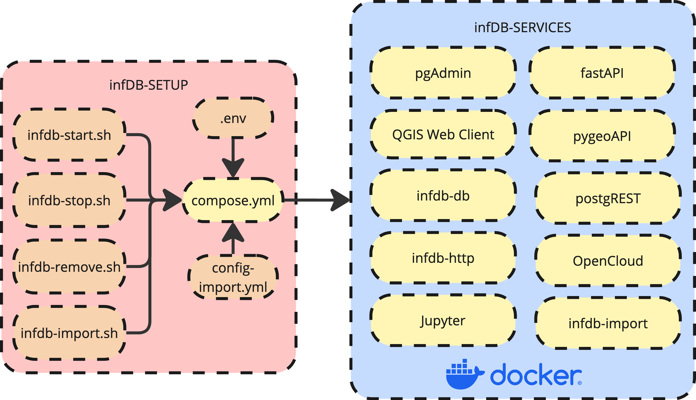

# infDB Architecture
The architecture of infDB is designed to be modular, scalable, and flexible, allowing for easy integration of various data sources and tools. This architecture is implemented using docker-compose to orchestrate multiple services, including the core database, data importers, and various processing tools.



The central docker compose file (`docker-compose.yml`) controls all containerized services. Bash scripts (`infdb-start.sh`, `infdb-stop.sh`, `infdb-remove.sh`, `infdb-import.sh`) are provided to simplify common tasks such as starting, stopping, and managing the entire infDB platform for the end user.

The configuration of the infDB uses environment variables defined in the `.env` file to customize settings such as database credentials, ports, and volume paths. The imported opendata sources can be managed via the `config-infdb-loader.yml` file, which specifies datasets to be ingested and their respective configurations.


The selection and configuration of services uses the in-built docker profiles functionality.
```bash
COMPOSE_PROFILES=core docker compose up
```
This command starts only the core services of infDB including the database. Additional services can be activated by extending the `COMPOSE_PROFILES` environment variable as list with other profiles.


