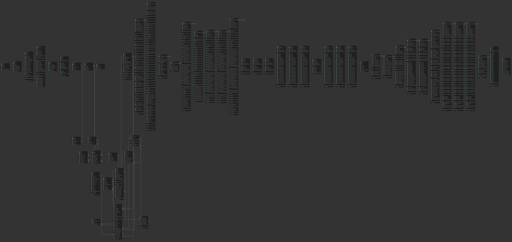

# Database Structure
The infDB database as service infdb-db is organized into multiple schemas to separate different types of data and functionalities:

- `public`: Default schema for extensions and general-purpose tables.
- `citydb`: Dedicated schema for 3DCityDB data.
- `opendata`: Imported open datasets in their raw format.
- `need`: Retrieved data from the NEED platform.
- `choose_a_name`: Each infDB tool uses its own schema to store processed data, views, and functions.

## ERD Diagram

<!-- ## Extensions
The following extensions are installed to enhance database capabilities:

- **PostGIS**: Adds support for geographic objects, enabling spatial queries and operations.
- **TimescaleDB**: Provides time-series data management with features like hypertables and continuous aggregates.
- **3DCityDB**: Manages 3D city models based on the CityGML standard.
- **pgRouting**: Offers routing and network analysis functionalities. -->

## Connection Details

By default, the database is accessible at:

-  **Host**: `localhost` (or `db` within Docker network)
-  **Port**: `5432` (internal) btw. `54328` (external) (or as configured in `.env`)
-  **User**: `postgres` (or as configured in `.env`)
