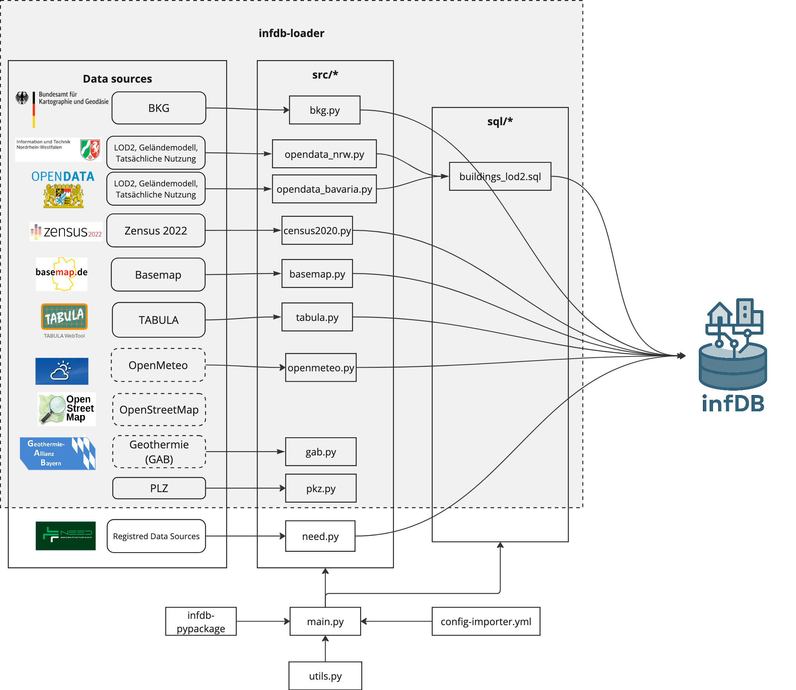

# infdb-importer

The infdb-importer is a service to import public opendata into infDB and automates the process of importing various open data formats, ensuring that new datasets are properly structured and integrated into the core database for immediate use.

## Key Features
: :material-plus-circle: modular - one python *.py file for each source
: :material-plus-circle: utils.py for common functions like downloading, unzipping, reading/writing to DB
: :material-plus-circle: config YAML file to define which sources to import and their parameters
: :material-plus-circle: multiprocessing to speed up ingestion of multiple datasets
: :material-plus-circle: logging for monitoring progress and errors


## Architecture
The infdb-importer is designed as a microservice that interacts directly with the infDB database. It leverages containerization to ensure consistent deployment and operation across different environments. The service can be configured to connect to various data sources, retrieve datasets, and transform them into the required format for storage in the database.



## Supported Data Formats and Sources
The infdb-importer supports a wide range of data formats and sources, including but not limited to:

- CSV files
- GeoJSON
- Shapefiles
- APIs from open data portals
- Remote databases

To add a new data source, you typically need to specify the source type, connection details, and any necessary transformation rules to map the incoming data to the database schema.

## Data Storage
The downloaded and processed raw data files are stored in a dedicated volume within the Docker environment to ensure persistence and easy access during the import process. The data in docker managed volume are persistent unless the volume is removed. This default configuration allows to re-use downloaded files between runs of the infdb-loader container, but also a simple removal without enhanced user privilege. 
<!-- Volume and therefore downloaded data can be removed for example by:
```bash
docker compose down -v
docker volume rm <volume_name>
docker volume prune
```
and similar commands. 
Also, as the volume management is done by the Docker engine, a de-installation or switch to other Docker engines can lead to loss of data in these volume. -->

## How to register new data sources - for Developers
### Prepare Development Environment
1. Open `infdb-loader` as folder in IDE
2. Make sure that no docker `infdb-loader` exists on your machine (stop and/or remove if necessary)
3. Open folder in a VS Code devcontainer 
4. In `main.py`, comment the following lines for faster development:

5.  Comment lines 50-52 for development so that the schema is not dropped on every run: (faster and not need for development)
```
# Drop schema "opendata" for clean development runs
with infdb.connect() as db:  # InfdbClient context
      db.execute_query("DROP SCHEMA IF EXISTS opendata CASCADE;")
```
6. Comment all data sources loading processes which are not needed for your development to speed up the process (e.g., comment line 
`processes.append(mp.Process(target=need.load, args=(infdb,), name="need"))`)

### Register New Data Source
#### Relevant files and folders:
- `main.py` is the main script to run the data loading process.
- `src/` contains scripts with load function for each data source.
- `configs/config-infdb-loader.yml` contains all configuration parameters for the infDB-loader including which data sources to load.

#### Registration process:
1. Create a new script in `src/` folder for your data source, e.g. `src/mydata.py`
2. Implement a `load(infdb: InfDB)` function in your script to load data from your data source into infDB. You can refer to existing scripts in the `src` folder for examples.
3. In `main.py`, import your new script at the top of the file:
```python
from src import mydata
```
4. In `main.py`, add a new process to the `processes` list to call your `load` function:
```python
processes.append(mp.Process(target=mydata.load, args=(infdb,), name="mydata"))
```
5. In `configs/config-infdb-loader.yml`, add any necessary configuration needed to load your data.


#### After development
1. Uncomment the lines you commented for development in `main.py`
2. Test your changes