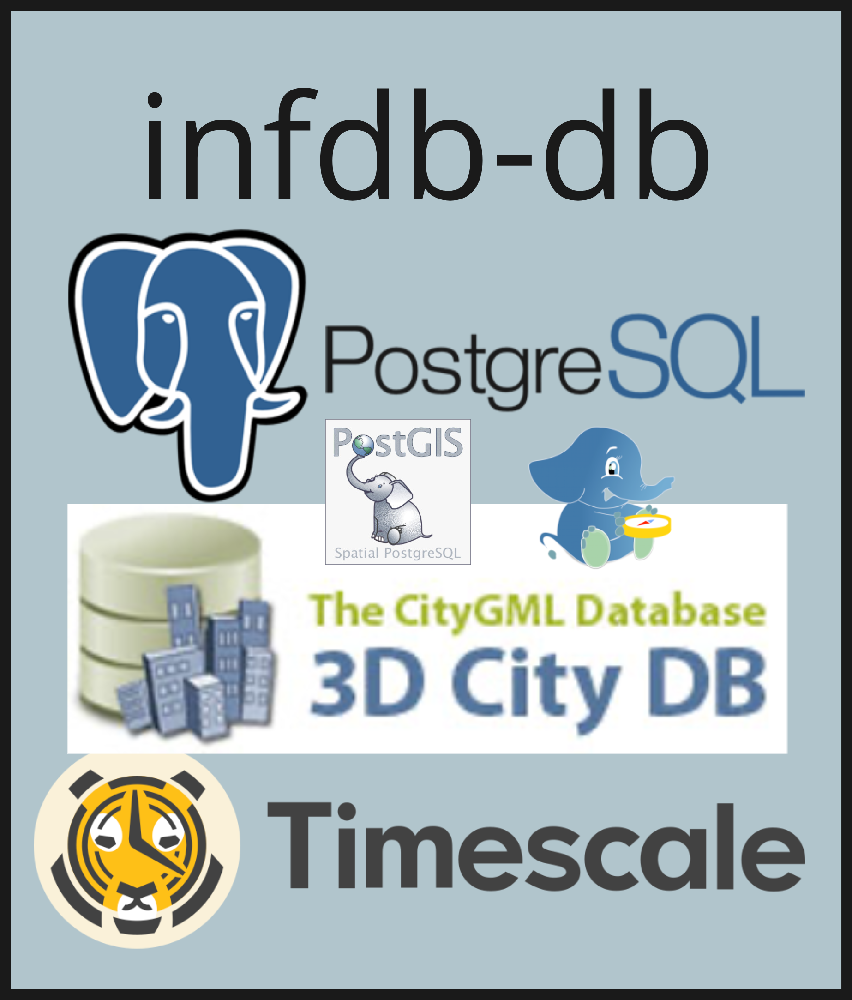

# Services

The infDB platform provides a suite of essential services designed to facilitate database operation and administration, data handling and visualization, and connectivity. Each preconfigured service can be activated individually to tailor the environment to your specific requirements. This section provides a brief description and configuration options for each available service.

## Available Services

- [infdb-db](#infdb-db): Core PostgreSQL database with PostGIS, timescaledb, and pgrouting extensions; handles all central storage and queries.
- [infdb-importer](#infdb-importer): Automates the ingestion, structuring, and integration of external open data formats into the platform.
- [pgAdmin](https://www.pgadmin.org/): Web UI for inspecting schemas, running SQL, managing roles; auto-configured credentials.
- [FastAPI](https://fastapi.tiangolo.com/): REST endpoints with OpenAPI docs and validated access to 3D, geospatial, and time-series data.
- [Jupyter](https://jupyter.org/): Notebook environment for exploratory queries, ETL prototypes, reproducible analysis.
- [QWC2](https://github.com/qwc-services/qwc2): Web mapping client for 2D/3D visualization, layer styling, spatial inspection, quick dataset validation.
- [PostgREST](https://postgrest.org/): Auto-generated REST API over PostgreSQL schemas using DB roles for auth; rapid, lightweight data access without extra backend code.
- [pygeoapi](https://pygeoapi.io/): OGC API (Features/Coverages/Processes) server exposing PostGIS data via standards-based JSON & HTML endpoints for interoperable geospatial discovery and querying.
- [opencloud](https://opencloud.com/): Cloud infrastructure and deployment management for scalable service orchestration and resource provisioning.

## infdb-db :material-database:
The core service **infdb-db** hosts the PostgreSQL database with extensions for geospatial, time series and graph data, serving as the central database within the platform. It handles data storage, retrieval, and management, ensuring integrity and high availability for connected services and tools. More information about the infDB database can be found at **[infDB -> Database](database.md)**.

## infdb-importer :material-cogs:
The **infdb-importer** service automates the ingestion and structuring of various external open data formats into the infDB platform. It supports multiple data sources and formats, transforming raw data into structured schemas within the database for easy access and analysis. More information about the infDB importer can be found at **[infDB -> infdb-importer](infdb-importer.md)**.

## pgAdmin
A web-based administration platform for PostgreSQL.

- **Purpose**: GUI for database management, query execution, and server monitoring.
- **Access**: Typically exposed on port `8080`.

## API Services

### FastAPI
Custom Python-based API server.

- **Purpose**: Specialized endpoints for complex logic that cannot be handled by simple SQL views.
- **Docs**: OpenAPI (Swagger) docs available at `/docs` endpoint.

### PostgREST
Serves a fully RESTful API from any existing PostgreSQL database.

- **Purpose**: Instant CRUD APIs for tables and views in the `api` schema.

### pygeoapi
A Python implementation of the OGC API suite of standards.

- **Purpose**: Standardized geospatial data access (OGC API Features).

## Visualization and Analysis

### QGIS Web Client (QWC2)
A responsive web application for QGIS Server.

- **Purpose**: 2D/3D map visualization of stored geospatial data.

### Jupyter Lab
Interactive development environment.

- **Purpose**: Python-based data analysis, prototyping, and notebook sharing.
