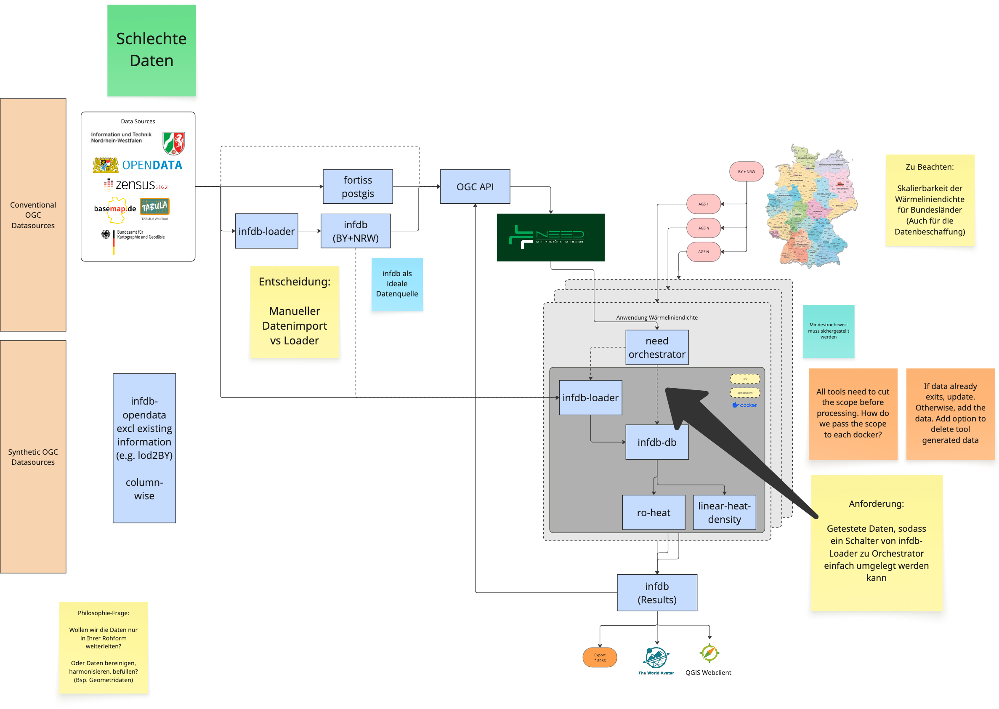
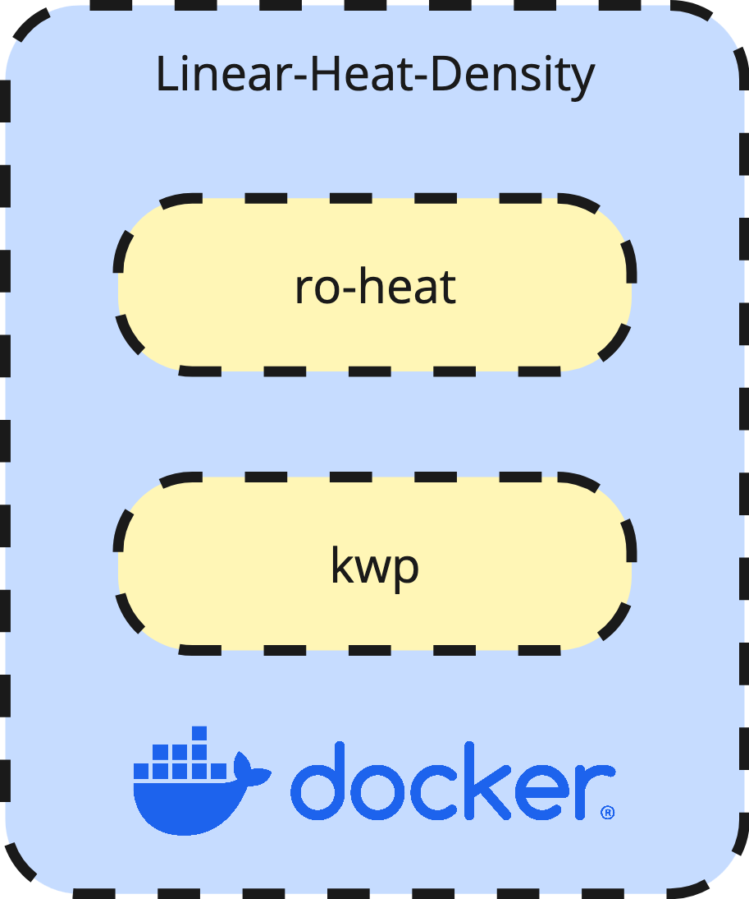

The **Linear Heat Density** use case aims to calculate the required heat demand at the street level for Bavaria and North Rhine-Westphalia, relying exclusively on open data and open-source tools. The entire toolchain—from raw data acquisition to the final results—is designed to be fully transparent, comprehensible, and reproducible.

## Toolchain

The **infDB** acts as the central hub of the Linear Heat Density toolchain. It orchestrates the complete workflow by managing data ingestion from primary sources, facilitating data exchange between tools, and handling the processing and linking of base data. Furthermore, it powers the visualization and export of the final results.

The architecture is designed for scalability, supporting multiprocessing through containerized applications. The geographic area is divided into sub-sections based on the *Amtlicher Gemeindeschlüssel* (AGS), allowing processing to be executed either sequentially per AGS or in parallelized batches.

    

### Open Data Sources
The project utilizes the following open datasets:

- **LOD2**: 3D building models for Bavaria (BY) and North Rhine-Westphalia (NRW).
- **Basemap**: Base geographic map data.
- **TABULA**: Typology of building energy performance.
- **Census 2022**: Demographic and housing data.
- **OpenStreetMap**: Used specifically for postcode data.

### Tools
The workflow integrates several specialized tools:

- **pro-streets**: Prepares the street network for district heating analysis.
- **ro-heat**: Performs the heat demand calculation.
- **assign-tool**: Aggregates heat demand density onto street segments.

### infdb-loader
*Content to be added.*

### infdb-basedata
*Content to be added.*

### ro-heat
*Content to be added.*

