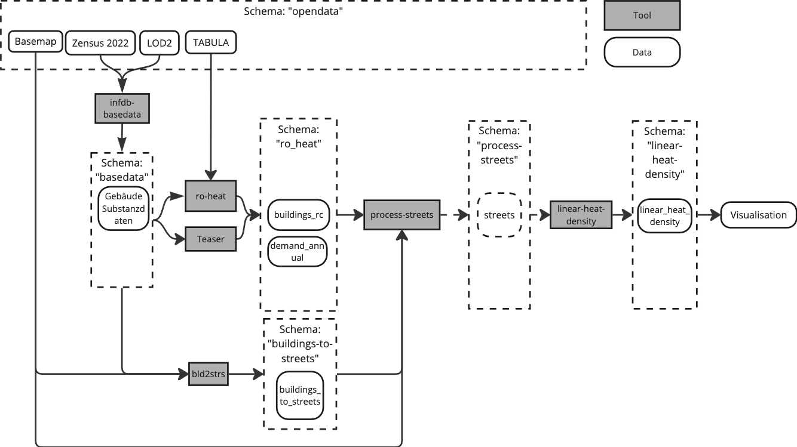

# Linear Heat Density Use Case

Within the linear heat density demo, we illustrate how to leverage the infDB platform to estimate the linear heat density of streets as a key metric for assessing the feasibility and efficiency of district heating systems.
This use case demonstrates the integration of various data sources and analytical tools within the infDB ecosystem to derive meaningful insights for urban energy infrastructure planning.


## Run Linear Heat Density
To run the complete toolchain of linear heat density, use the following command:
```bash
bash tools/run_linear-heat-density.sh
```
The infDB connects then several tool in order to determine the linear heat density by estimating the heat demand on a building level and procesing suited streets for district heating.

## Toolchain


The whole linear heat density toolchain is implemented through a combination of open-source tools and custom scripts tailored to specific requirements, executed within the infDB environment:

1. The building heat demand is estimated on a building level using statistical data and building characteristics. 
2. Suitable streets for district heating are identified based on various criteria such as building density, street length, and connectivity. 
3. The linear heat density is calculated by aggregating the heat demand of buildings along each street segment and dividing it by the length of the street.





