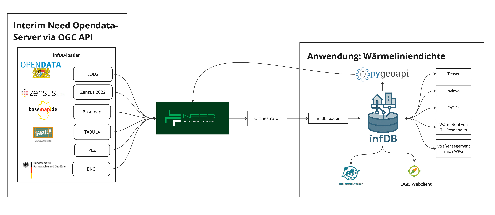

# Linear Heat Density

## Overview
The used opendata is loaded from the Need plattform into the infDB.

The whole toolchain from the data to the tools is open source.

## Run Linear Heat Density
To run the complete toolchain of linear heat density, use the following command:
```bash
bash tools/run_linear-heat-density.sh
```
The infDB connects then several tool in order to determine the linear heat density by estimating the heat demand on a building level and procesing suited streets for district heating.

## Toolchain
The toolchain of the Linear Heat Density is composed of several tools. Each tool creates a new schema storing the results.


