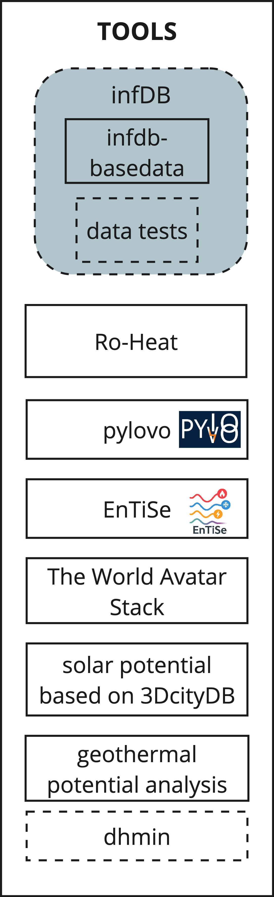

# Tools
The InfDB ecosystem includes a variety of tools designed to handle different aspects of data workflows. These so called tools are software that interact with InfDB and process data through standardized, open interfaces. This modular approach allows you to tackle problems of any complexity by combining different tools into custom toolchains.

Different tools can be linked together to form profiles, which are predefined sequences of tools that work together to achieve a specific goal. For example, a profile might include a data transformation tool followed by a validation tool and then an enrichment tool. By running a profile, you can execute all the included tools in the correct order with minimal effort.
<!-- <p align="center">
  
</p> -->

## Run Single Tools or Profiles

### Prerequisites
- [Docker Desktop](https://docs.docker.com/get-started/get-docker/) (or Docker Engine) installed
- [uv](https://docs.astral.sh/uv/getting-started/installation/) Package manager (only for multiple AGS)
### Single AGS
If you want to run a profile (multiple linked tools) or a single tool, you can use the bash script `tools/tools.sh`:
```bash
# Profile
# bash tools/tools.sh -p PROFILE AGS
bash tools/tools.sh -p linear 09185149

# Single Tool
# bash tools/tools.sh -t TOOL AGS
bash tools/tools.sh -t ro-heat 09185149
```

### Multiple AGS
The `run_ags.py` script allows you to run a profile or a single tool for multiple AGS in parallel. The script uses the `uv` to manage the python packages and dependencies.
```bash
# Profile
uv run python3 tools/run_ags.py -p linear [-a AGS1,AGS2,... -n NUM_WORKERS -c]

# Single Tool
uv run python3 tools/run_ags.py -t ro-heat [-a AGS1,AGS2,... -n NUM_WORKERS -c]
```
By default, the script will run all available AGS in InfDB with 5 parallel workers. You can adjust this with the following optional parameters:

- `-a AGS1,AGS2,...`: Comma-separated list of AGS
- `-n NUM_WORKERS`: Number of parallel workers to use (default: 5)
- `-c`: Clean database before running

AGS can be found on the website of the [Statistisches Bundesamt](https://www.statistikportal.de/de/gemeindeverzeichnis). A few examples for AGS:

- 09780139 Sonthofen
- 09185149 Neuburg a. d. Donau
- 05119000 Oberhausen (NRW)

## Tools Template
If you want to or create or integrate your own software or scripts into the InfDB ecosystem, you can use the template for a devContainer provided by the InfDB. A more detailed description can be found under Tools -> [Tools Template](dev-container/index.md).

## Python Package
Moreover, there is a python package `infdb` that can be used to interact with the InfDB database and services. It provides functionalities for database connections, logging, configuration management, and utility functions. You can find more information about the package in the [API -> pyinfdb](../api/pyinfdb/index.md).


## Currently Integrated Tools
The following tools are currently integrated with InfDB:

- **[InfDB-basedata-buildings](infdb-basedata-buildings/index.md)**: Containerized pipeline to generate fundamental building data
- **[InfDB-basedata-ways](infdb-basedata-ways/index.md)**: Containerized pipeline to generate fundamental way data
- **[pylovo-generation](https://github.com/tum-ens/pylovo)**: Python tool for generating synthetic low-voltage distribution grids
- **[EnTiSe](https://github.com/tum-ens/EnTiSe)**: Python tool for energy time series generation and management


