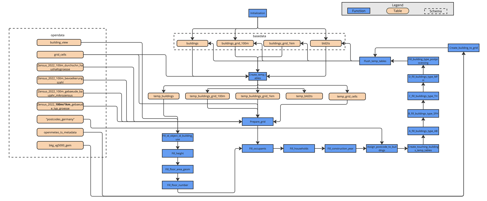

# Data Pipeline

The data pipeline of the `infDB-basedata-buildings` is shown in the following figure. It consists of three main stages: data transformation, validation and enrichment. The pipeline is designed to process building-related data from various sources and prepare it for use in infDB.

### Output Data

The main output of the tool is:

- Detailed Building Information (e.g. Building Type, Number of Households, Number of floors)
- Building Time Series Information - specified using geographical location (e.g. openmeteo hourly temperature)

The output datasets are stored in the `basedata` schema of the infDB PostgreSQL database. It contains the following tables:

- buildings_grid_100m: Contains Zensus 2022 building information for 100m x 100m grid cells (number of inhabitants, average household size, distribution of building types, distribution of construction years).
- buildings_grid_1km: Contains Zensus 2022 building information for 1km x 1km grid cells (number of inhabitants, average household size, distribution of building types, distribution of construction years).
- buildings: Contains information for each specific building defined in the LOD2 database within the chosen AGS (height, floor area, number of floors, building use, building type, number of occupants, number of households, construction period, geographical information)
- bld2ts: Relates every building in the LOD2 database with its specific time series data within the chosen AGS (openmeteo hourly temperature)
