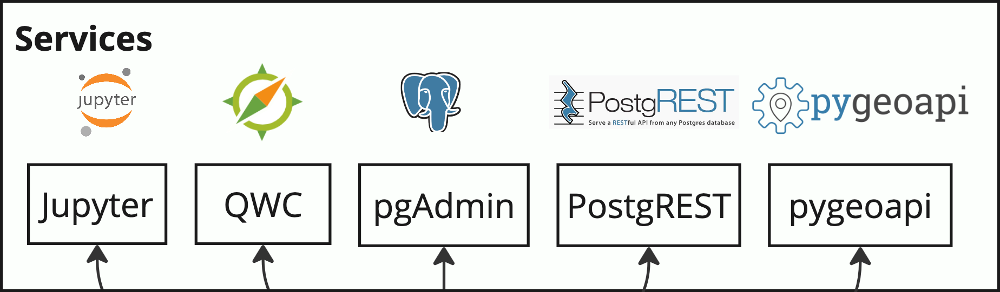

The infDB platform provides a suite of essential services designed to facilitate administration, visualization, and connectivity. Each preconfigured service can be activated individually to tailor the environment to your specific requirements. This section provides a brief description and configuration options for each available service.



## Jupyter Notebook
Jupyter Notebook allows you to interactively work with the data by running Python scripts and visualize results directly within your browser. It is an excellent tool for data exploration and prototyping.

The configuration 
``` bash title=".env"
# ==============================================================================
# SERVICE ACTIVATION
# ==============================================================================
# Select profiles to activate
COMPOSE_PROFILES=...,notebook,...  # (1)

# ==============================================================================
# JUPYTER NOTEBOOK (Development Environment)
# ==============================================================================
# Profile: notebook

# Port to expose Jupyter on the host machine
SERVICES_JUPYTER_EXPOSED_PORT=8888 # (2)

# Enable Jupyter Lab interface (yes/no)
SERVICES_JUPYTER_ENABLE_LAB=yes

# Authentication token for Jupyter
SERVICES_JUPYTER_TOKEN=infdb # (3)

# Path to notebook files
SERVICES_JUPYTER_PATH_BASE=..src/notebooks/
```

1. Profile "notebook" must be within the list to activate Jupyter service
2. Port on which the Jupyter is available 
3. Token for identification to Jupyter Notebook

If you activated the service, it should be availalbe on the default port SERVICES_JUPYTER_EXPOSED_PORT=8888 and you access it in your browser via:
=== "Local"
    http://localhost/8888

=== "Remote"
    http://IP-ADDRESS-OF-HOST/8888


## QGIS Webclient (QWC)

## pgAdmin


## Visualize infDB data in QWC Web Client
1. In [.env](.env) make sure profiles `core` and `qwc`to `COMPOSE_PROFILES`
2. Restart infDB with new profile to start services including QWC Web Client:
```bash
bash infdb-startup.sh
```
3. Open http://localhost:80/ in your web browser.

## Inspect infDB Data in Database with Postgres Admin UI
1. In [.env](.env) make sure profiles `core` and `admin`to `COMPOSE_PROFILES`
2. Restart infDB with new profile to start services including QWC Web Client:
```bash
bash infdb-startup.sh
```
3. Open http://localhost:82/ in your web browser.