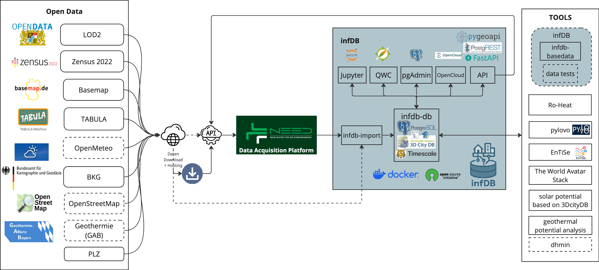

# Summary
#### I would write this more concretely as the previous version was rather vague and did not make clear what infDB provides. I think explaining the concrete software and the intended use cases is important. I even added some examples of applications to make it more tangible.
`infDB - Infrastructure and Energy Database` is an open-source, containerized data infrastructure for managing and providing access to heterogeneous energy and infrastructure datasets used in urban and regional energy system studies. It bundles a PostgreSQL-based database with geospatial and time-series extensions, standardized REST and OGC-compliant APIs, and configurable import services that transform raw public data into structured, version-controlled schemas.

By separating data ingestion, storage, and access from downstream analysis and modeling tools, infDB reduces data preprocessing effort and enables reproducible, transferable energy modeling workflows across regions and projects. In that way it can be used for many different applications in energy system modeling, such as district heating planning, electrical distribution network analysis, or urban energy demand estimation.
  

# Statement of need
#### I would not make it as focused on Germany and rather keep it more general. But this mostly depends on if you want to focus on the data sources more or the gray box in you figure (Services). I would rather say that energy system analysts suffer from these issues worldwide.
The transition to climate-neutral heating is a central pillar of energy policy, exemplified by Germany's aim for climate neutrality by 2045. New legislative frameworks, such as the requirement for Municipal Heat Planning (KWP) and the transparency obligations of the German Energy Industry Act (EnWG §14d), demand that municipalities and Distribution System Operators (DSOs) process vast amounts of energy and infrastructure data [@kwp:2026; @14d:2026].

However, the current landscape of energy data is fragmented. While the Open Data Strategy of the Federal German Government [@Open-Data-Strategie:2021] has increased data availability, this data is published by disparate authorities on different platforms in varying formats, spatial resolutions, and licensing structures. Consequently, energy modeling workflows often suffer from:

1. **Lack of Reproducibility:** Plannings results are often one-off studies that are difficult to update or audit.
2. **High Pre-processing Effort:** Researchers spend disproportionate time acquiring raw data before analysis.
3. **Limited Workflow Transferability:** Data processing workflows often require substantial adaptation across regions due to differing data formats, interfaces, and conventions.
4. **Siloed Infrastructure:** DSOs and municipalities lack standardized tools to manage and share distribution network data efficiently.

`infDB` addresses these challenges by providing a reproducible, version-controlled, and automated ETL (Extract, Transform, Load) pipeline. It acts as a middleware between raw public data and high-level energy modeling tools, ensuring that planning data is transparent, traceable, and easily updatable.

# State of the field
Energy and infrastructure data management is an active field with several existing solutions:

* **Commercial Platforms:** Tools like **nPro**, **Solarea**, and **flexRM** offer robust analytics and user interfaces but are proprietary, limiting transparency and community extension.
* **Open Source Modeling Frameworks:** Tools like **City Energy Analyst (CEA)**, **EUReCA** and **OpenPlan** excel at simulation and optimization but often assume the existence of cleaned, structured input data.
* **Data Initiatives:** The **NEED project** [@NEED:2023] provides a decentralized data hub for synthetic energy data, and **DB4KWP** [@DB4KWP:2026] focuses on ontologies (OEO/OEKG) and naming conventions.

`infDB` addresses a critical gap in the energy data ecosystem. While simulation tools like the City Energy Analyst excel at modeling, `infDB` provides the foundational data infrastructure that these tools require. Unlike static data repositories, `infDB` offers an dynamic, service-oriented platform that enables users to deploy local instances, continuously integrate fresh datasets, and seamlessly connect with both commercial and open-source downstream tools. By providing a technical implementation layer, `infDB` can complement ontology initiatives like DB4KWP, transforming conceptual data standards into practical, operational systems.

# Software Design
`infDB` follows a modular microservices architecture orchestrated via Docker Compose. The system is conceptually divided into **Services**, which provide the foundational infrastructure, and **Tools**, which consume and process the data. This separation allows for high portability and enables users to activate only the components required for their specific use case.

<!-- ### infDB - Services -->
The *Services* layer (depicted in the grey box in \autoref{fig:infdb-overview}) handles database operations, administration, data ingestion, and connectivity. These containerized services include:

* **infdb-importer:** This service automates the ingestion of diverse open data sources. It transforms raw external formats into structured schemas within the database. Users control this process via a simple YAML configuration file (`config-infdb-loader.yml`), eliminating the need for custom ETL scripting.
* **infdb-db:** The central storage engine hosting a PostgreSQL database. It is pre-configured with essential extensions for energy modeling:
    * **PostGIS** for geospatial data.
    * **TimescaleDB** for time-series data.
    * **3D City DB** for (3D) semantic city models.
    * **pgRouting** for graph-based network analysis.
* **APIs:** This layer provides standardized interfaces to external applications, ensuring the database remains accessible but secure. It includes **FastAPI** for custom logic, **pygeoAPI** for OGC standards, and **PostgREST** for immediate RESTful access to database tables.
* **pgAdmin:** A web-based GUI for database administration, allowing users to inspect schemas, run queries, and manage data without command-line interaction.
* **JupyterNotebook:** An interactive environment pre-loaded with the `pyinfdb` library, enabling users to prototype data analyses and visualize results directly within the platform.
* **QGIS Webclient:** A web-based GIS client for visualizing geospatial data stored in the database, useful for urban planners and GIS specialists.
* **OpenCloud:** An optional component for integrating with cloud storage solutions, facilitating scalable data handling for large datasets.

<!-- ### infDB - Tools -->
The *Tools* layer (depicted in the right box in the architecture diagram) consists of (external) software that interacts with the `infDB` Services to process data or generate insights. This modular approach allows users to chain different tools into custom workflows. Tools can be built upon following foundations:

* **Standardized Integration:** Tools interact with the core database exclusively through open interfaces (SQL or REST APIs), ensuring that the underlying data schema remains consistent regardless of the tool used.
* **pyinfdb:** To facilitate the development of custom tools, the platform provides the `pyinfdb` Python package. This library abstracts database connections, logging, and configuration management, allowing researchers to rapidly develop Python-based analysis scripts that integrate seamlessly with the infDB ecosystem.
* **Extensible Ecosystem:** Because the architecture relies on standard interfaces, users can integrate existing third-party simulation software or develop proprietary tools that plug into the `infDB` backend without modifying the core services.

Platform management as shown in \autoref{fig:architecture} is simplified through provided Bash scripts (e.g., for startup and teardown) and environment variable configurations (`.env`), ensuring that the entire infrastructure can be deployed or replicated with minimal effort.

# Research Relevance
The major research impact of `infDB` is the standardization of energy system analysis workflows. By decoupling data management from modeling logic, it allows for:

* **Reproducibility:** The containerized approach ensures that an working environment can be ensured and replicated on any machine.
* **Continouity:** Automated importers allow researchers to regularly update their datasets as new open data becomes available, transforming static one-time snapshots into dynamic continuous analysis.
* **Stability:** Researchers can focus on developing algorithms (e.g., for district heating expansion) relying on a stable database schema, rather than adapting algorithms to shifting input formats.

# Applications
A key use case is calculating linear heat density, i.e., estimating building heat demands and distributing them along street segments, to asses the financial feasibility of district heating as basis for municipal heat planning (KWP) or district heating feasibility studies (BEW). Using `infDB`, researchers and planners can immediately leverage preprocessed, enriched open building data (LOD2) combined with statistical census data to compute building-level heat demand. This approach reduces computational overhead and development effort compared to traditional file-based GIS workflows, while providing reproducible, auditable results that can be continuously updated as new data becomes available.

# AI usage disclosure
In the development of this work, GitHub Copilot, ChatGPT, and Gemini were used. Github Copilot assisted in code generation by code suggestions and completion tasks, while ChatGPT and Gemini assisted in drafting and refining textual content.

# Acknowledgements
We gratefully acknowledge financial support through the project executing agency Jülich (PTJ) with funds provided by the Federal Ministry for Economic Affairs and Climate Action (BMWK) due to an enactment of the German Bundestag under Grant No. 01256602/1.

# References

